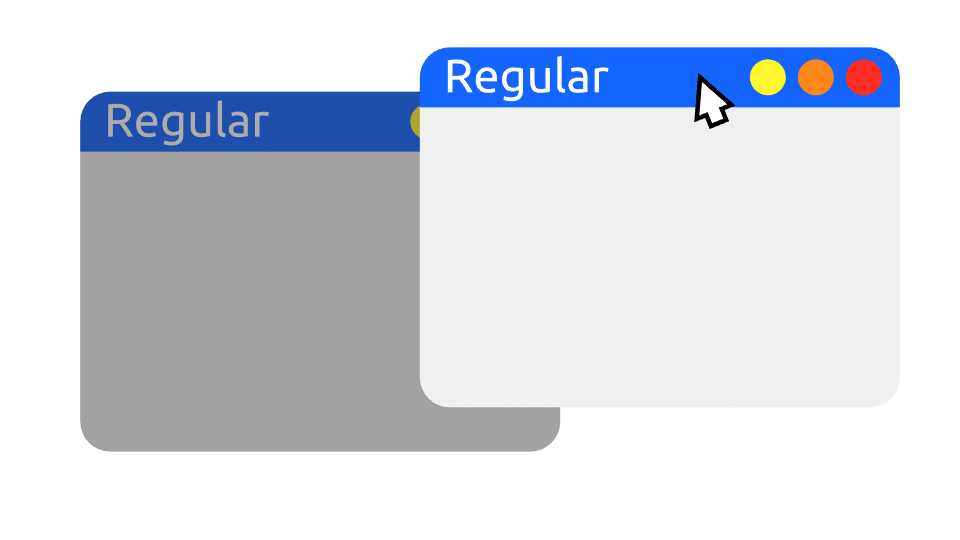
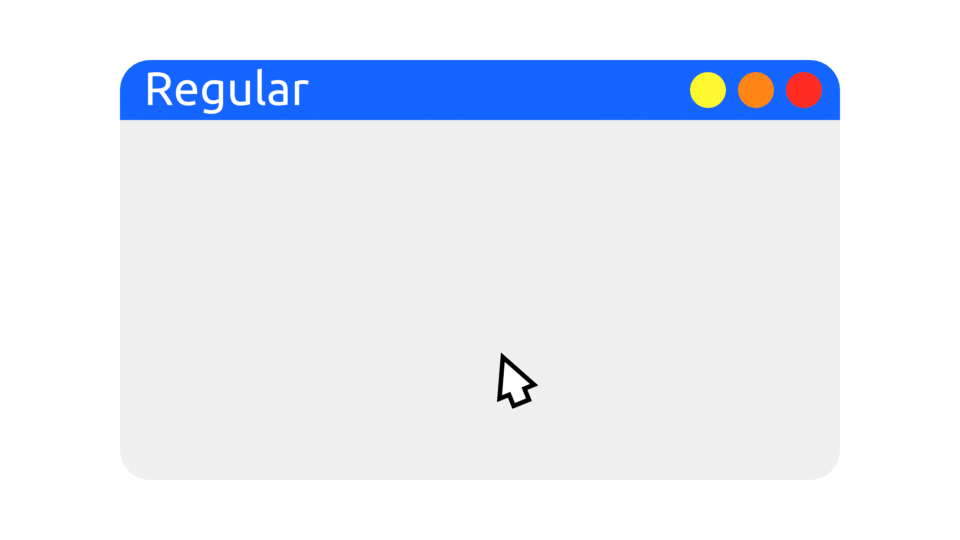
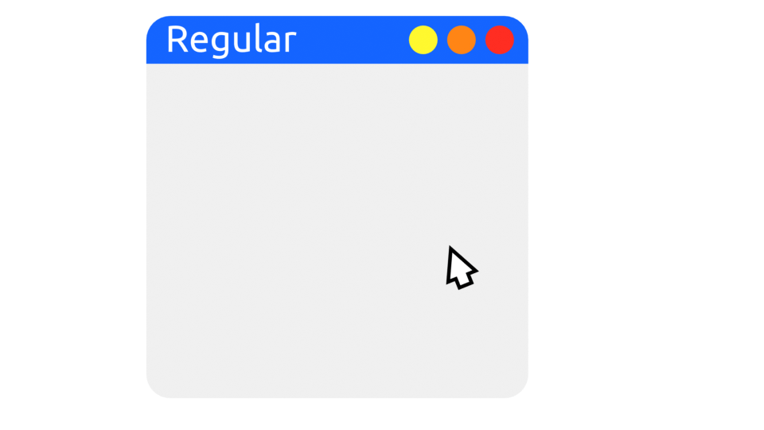
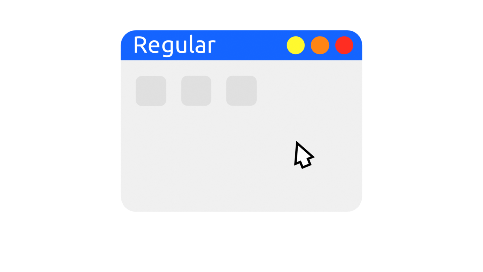
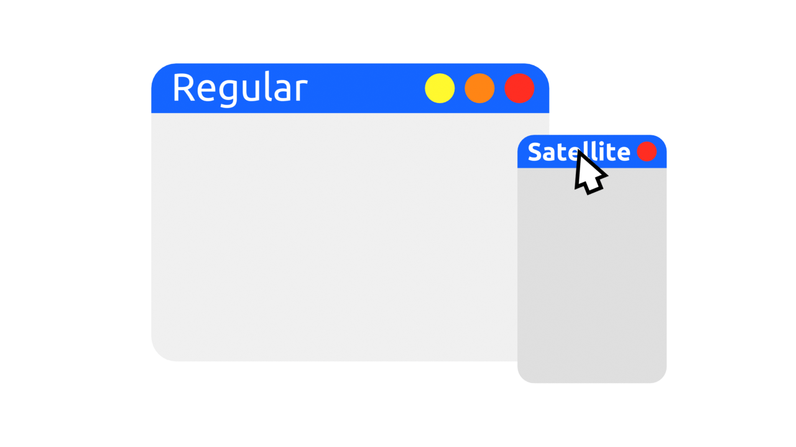

(exp-window-positions-under-wayland)=

# Window positions under Wayland

## Preamble

Design is all about balance, and the design of graphical user interfaces has a lot of interests to be balanced. In the context of Wayland, the principle interested parties are the designer of the compositor/window manager/shell [server] and the designer of the application toolkit/application [client]. Wayland is the "language" these two parties use to communicate.

A [recent thread](https://www.mail-archive.com/wayland-devel@lists.freedesktop.org/msg41597.html) on the wayland-devel mailing list highlighted once again that these interests are not identical. The thread focuses on the placement of windows and that is what I want to address here.

## The designers

For the designer of a server it is clear that applications ought to be "well behaved" and not be allowed to place windows in arbitrary positions. There are even security concerns about placing windows to intercept input such as passwords. And only the server can provide consistent window behaviors across multiple applications and toolkits.

For the designer of a client it is clear that the toolkit is best placed to decide where windows are best placed. And only the client can provide consistent window behaviors across multiple servers and operating systems.

## The conflict

Both sides have a point that they should be "in control", but clearly that isn't going to happen.

Legacy windowing systems such as X11 allowed clients complete freedom, and the issues that caused were among the motivations for doing things differently in Wayland.

Throughout the design of Wayland the approach has been for the client to make requests and the server to make the final decisions.

Obviously, that approach leads to frustration on the part of designers of clients as they are losing some of the flexibility they are accustomed to.

## The balance

Although a lot of freedom is indeed being lost, when looking at applications in the real world they only use a small fraction of that and for some specific cases. That's not surprising, as they are supporting some visual "idioms" that users recognize because they are shared across applications.

1. Regular or "top level" windows
   
   These are handled by `xdg-shell`'s `xdg_toplevel`.

1. Dialog windows
   
   These are handled by `xdg-shell`'s `xdg_toplevel` with the "parent" set.

1. Menu and Popup windows
   
   These are handled by `xdg-shell`'s `xdg_popup` with a "grab"

1. Tooltip and hover windows
   
   These are handled by `xdg-shell`'s `xdg_popup`.

1. Satellite and toolbox windows
   
   These are not currently handled by a Wayland extension, but could be added in a way consistent with the support for other window types.

## Conclusion

While client developers (of applications and toolkits) may be surprised that they can't set absolute geometry there are a number of objections to allowing it:

1. preventing placement of windows to interfere with elements of the shell such as docks;
1. allowing for how the shell is laid out (docs, multi-screen display walls, etc);
1. no need for application to know how its own windows are laid out

The approach taken by Wayland supports most of the windowing idioms recognized by users and can be extended to cover more without allowing clients complete freedom.
