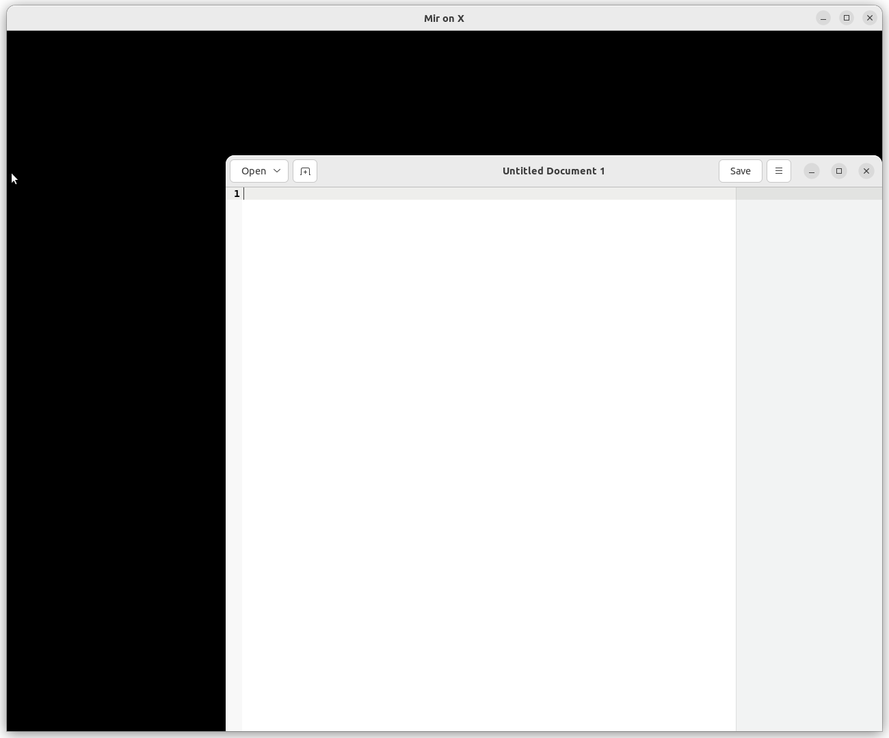

# Developing a Wayland Compositor using Mir

## Overview

The Mir project provides libraries for creating Wayland compositors. The design is intended to make it easy build something simple and easy to customize the compositor in a number of ways.

Within the Mir codebase there are four different Wayland compositors each demonstrating a different behaviour. There are additional compositors maintained and written by the Mir team in a number of Snaps. Most notably, Ubuntu Frame.

Outside the Mir codebase there are at least four compositors based on Mir that support different uses.

Here's the full list, linking to the code:

Compositor|Description
--|--
[Miriway](https://github.com/Miriway/Miriway)|A minimal desktop shell
[Lomiri](https://lomiri.com/)|The shell used by Ubuntu Touch, aspires to be "convergent": that is work across various form factors (including desktop)
[Ubuntu Frame](https://github.com/canonical/ubuntu-frame/tree/main/src)|Runs an app (or apps) fullscreen, intended for embedded/IoT use
[Miracle](https://github.com/miracle-wm-org/miracle-wm)| A tiling window manager much like i3/sway
[egmde](https://github.com/AlanGriffiths/egmde)|An example desktop environment used to write tutorials about writing Mir compositors
[lomiri-system-compositor](https://gitlab.com/ubports/development/core/lomiri-system-compositor/)|Owns the display and input hardware and supports a nested shell with fewer permissions
[miral-kiosk](https://github.com/canonical/mir/tree/main/examples/miral-kiosk)|Runs an app (or apps) maximized
[miral-shell](https://github.com/canonical/mir/tree/main/examples/miral-shell)|Options for "floating" or "tiling" window management and a limited "desktop" experience with workspaces and a keyboard shortcut for launching a terminal
[mir_demo_server](https://github.com/canonical/mir/tree/main/examples/mir_demo_server)|"floating" window management, enables by default all the Wayland extensions Mir supports
[mir_kiosk_x11](https://github.com/canonical/mir/tree/main/examples/mir-x11-kiosk)|Minimal compositor to support fullscreen X11 applications
[miral-system-compositor](https://github.com/canonical/mir/tree/main/examples/miral-system-compositor)|Owns the display and input hardware and supports a nested shell with fewer permissions
[mirco](https://github.com/wmww/mirco)|The basis of experiments moving MATE shell components to Wayland

For all of these examples Mir provides the code and logic connecting the display and input hardware, and the Wayland protocols connecting to the client. Mir also separates out the concerns such as Window Management,  abstracts the graphics  stack, and manages Wayland extensions:

* For Window management it provides a default "floating window" strategy, but also provides enough customisation points to support "fullscreen" and "tiling" strategies to be written in high level code;
* For the graphics stack Mir dynamically loads one of several backends (there are five supported by Mir and one more supported by UBports); and,
* Mir implements a range of Wayland extensions (and compositors can add more), some of these are disabled by default (e.g. for security) but can be enabled by compositors either globally or for specific applications.

While much of the above list is examples or experiments of one form or another it proves Mir is flexible and has shipped as a product (in Ubuntu Touch and Ubuntu Frame).

Mir is proven technology that provides a sound base for building your Wayland compositor.

## Anatomy of a Wayland Compositor

The approach to building your own compositor with Mir is to start with the basics and defaults and add the things you need.

The simplest Wayland compositor can be written in just a few lines:

```cpp
#include <miral/runner.h>
#include <miral/minimal_window_manager.h>
#include <miral/set_window_management_policy.h>

using namespace miral;

int main(int argc, char const* argv[])
{
    MirRunner runner{argc, argv};

    return runner.run_with(
        {
            set_window_management_policy<MinimalWindowManager>()
        });
}
```

Here, you can see a number of things:

* It is written in C++, a popular high-performance language that supports powerful abstractions;
* It is not much longer than the canonical "Hello World" example; and,
* The code creates a `MirRunner` and then calls `run_with()` supplying the things you wish to add.

When writing your compositor you will deal mostly with the abstractions provided by MirAL (the "Mir Abstraction Layer"). This example shows three:

* `MirRunner` - a class that manages your Mir Wayland compositor
* `MinimalWindowManager` - a simple "floating" window management policy
* `set_window_management_policy` - a functor that applies a window management policy to `MirRunner`.

This example code will build and provides a fully working Wayland compositor that supports the graphics stacks and Wayland protocols available with Mir. (Note you also need to install and use `libmiral-dev` and `mir-graphics-drivers-desktop` for this.)

If you look at any of the examples listed above you will see this pattern repeated. We will look more closely at one of these examples later, but first we'll deal with building and running this example.

## Building and running a Wayland Compositor

To compile your program you'll need your normal C++ toolchain and the MirAL [Mir Abstraction Layer] library. In addition to this, running the program needs an appropriate Mir "graphics platform". For a typical development environment this will be something like:

```bash
sudo apt install libmiral-dev mir-graphics-drivers-desktop
```
If, like the Mir project itself, you're using G++ and CMake, then here's a `CMakeLists.txt` for the "Hello World" example shown above. (If you're using another toolchain, you hopefully know how to do the equivalent with that.)
```text
cmake_minimum_required(VERSION 3.23)
project(hello_world)

set(CMAKE_CXX_STANDARD 20)
set(CMAKE_CXX_EXTENSIONS OFF)
set(CMAKE_CXX_STANDARD_REQUIRED ON)

include(FindPkgConfig)
pkg_check_modules(MIRAL miral REQUIRED)

add_executable(hello_world main.cpp)

target_include_directories(hello_world PUBLIC SYSTEM ${MIRAL_INCLUDE_DIRS})
target_link_libraries(     hello_world               ${MIRAL_LDFLAGS})
```

With that, you can build and run as follows:

```bash
cmake -B cmake-build/
cmake --build cmake-build/
WAYLAND_DISPLAY=wayland-99 cmake-build/hello_world
```

We specify the `WAYLAND_DISPLAY` environment variable for two reasons: because there may be an existing Wayland compositor in your user session; and, so that we can start another application that knows where to connect:
```bash
WAYLAND_DISPLAY=wayland-99 gedit
```



Of course, this is a very minimalistic example and most compositors will be running as part of an ecosystem that launches appications without typing in these incantations.

## An advanced example: Miriway

Compositors can be built for various purposes, but the best example to explain the possibilities is the most recent addition to the family: Miriway. This provides a very "bare bones" graphical shell that can be used as a "Desktop Environment". It can be configured to work with a range of components from Wayland based environments and these include "background", "docks" and other panels, "launchers" and other applications.

Because Miriway attempts to do more than the "Hello World" example it passes a longer list to `run_with()` but the the structure is the same. The various objects passed need to be defined in a scope (such as the body of `main()` as used here) that ensures they live for the duration of the call:

```cpp
int main(int argc, char const* argv[])
{
    MirRunner runner{argc, argv};

    // Change the default Wayland extensions to:
    //  1. to enable screen capture; and,
    //  2. to allow pointer confinement (used by, for example, games)
    // Because we prioritise `user_preference()` these can be disabled by the configuration
    WaylandExtensions extensions;
    for (auto const& protocol : {
        WaylandExtensions::zwlr_screencopy_manager_v1,
        WaylandExtensions::zxdg_output_manager_v1,
        "zwp_pointer_constraints_v1",
        "zwp_relative_pointer_manager_v1"})
    {
        extensions.conditionally_enable(protocol, [&](WaylandExtensions::EnableInfo const& info)
            {
                return info.user_preference().value_or(true);
            });
    }

    // To support docks, onscreen keyboards, launchers and the like; enable a number of protocol extensions,
    // but, because they have security implications only for those applications found in `shell_pids`.
    // We'll use `shell_pids` to track "shell-*" processes.
    // We also check `user_preference()` so these can be enabled by the configuration
    ShellPids shell_pids;
    // Protocols we're reserving for shell components_option
    for (auto const& protocol : {
        WaylandExtensions::zwlr_layer_shell_v1,
        WaylandExtensions::zxdg_output_manager_v1,
        WaylandExtensions::zwlr_foreign_toplevel_manager_v1,
        WaylandExtensions::zwp_virtual_keyboard_manager_v1,
        WaylandExtensions::zwp_input_method_manager_v2})
    {
        extensions.conditionally_enable(protocol, [&](WaylandExtensions::EnableInfo const& info)
            {
                pid_t const pid = pid_of(info.app());
                return shell_pids.is_found(pid) || info.user_preference().value_or(false);
            });
    }

    ExternalClientLauncher client_launcher;

    // A configuration option to start applications when compositor starts and record them in `shell_pids`.
    // Because of the previous section, this allows them some extra Wayland extensions
    ConfigurationOption components_option{
        [&](std::vector<std::string> const& apps)
            {
            for (auto const& app : apps)
            {
                shell_pids.insert(client_launcher.launch(ExternalClientLauncher::split_command(app)));
            }
            },
        "shell-component",
        "Shell component to launch on startup (may be specified multiple times)"};

    // `shell_meta` and `shell_ctrl_alt` provide a lookup to execute the commands configured by the corresponding
    // `shell_meta_option` and `shell_ctrl_alt_option` configuration options. These processes are added to `shell_pids`
    CommandIndex shell_meta{[&](auto cmd){ shell_pids.insert(client_launcher.launch(cmd)); }};
    CommandIndex shell_ctrl_alt{[&](auto cmd){ shell_pids.insert(client_launcher.launch(cmd)); }};
    ConfigurationOption shell_meta_option{
        [&](std::vector<std::string> const& cmds) { shell_meta.populate(cmds); },
        "shell-meta",
        "meta <key>:<command> shortcut with shell priviledges (may be specified multiple times)"};
    ConfigurationOption shell_ctrl_alt_option{
        [&](std::vector<std::string> const& cmds) { shell_ctrl_alt.populate(cmds); },
        "shell-ctrl-alt",
        "ctrl-alt <key>:<command> shortcut with shell priviledges (may be specified multiple times)"};

    // `meta` and `ctrl_alt` provide a lookup to execute the commands configured by the corresponding
    // `meta_option` and `ctrl_alt_option` configuration options. These processes are NOT added to `shell_pids`
    CommandIndex meta{[&](auto cmd){ client_launcher.launch(cmd); }};
    CommandIndex ctrl_alt{[&](auto cmd){ client_launcher.launch(cmd); }};
    ConfigurationOption ctrl_alt_option{
        [&](std::vector<std::string> const& cmds) { ctrl_alt.populate(cmds); },
        "ctrl-alt",
        "ctrl-alt <key>:<command> shortcut (may be specified multiple times)"};
    ConfigurationOption meta_option{
        [&](std::vector<std::string> const& cmds) { meta.populate(cmds); },
        "meta",
        "meta <key>:<command> shortcut (may be specified multiple times)"};

    // Process input events to identifies commands Miriway needs to handle
    ShellCommands commands{
        runner,
        [&] (auto c) { return shell_meta.try_launch(c) || meta.try_launch(c); },
        [&] (auto c) { return shell_ctrl_alt.try_launch(c) || ctrl_alt.try_launch(c); }};

    return runner.run_with(
        {
            X11Support{},
            extensions,
            display_configuration_options,
            client_launcher,
            components_option,
            shell_ctrl_alt_option,
            shell_meta_option,
            ctrl_alt_option,
            meta_option,
            Keymap{},
            PrependEventFilter{[&](MirEvent const*) { shell_pids.reap(); return false; }},
            AppendEventFilter{[&](MirEvent const* e) { return commands.input_event(e); }},
            set_window_management_policy<WindowManagerPolicy>(commands)
        });
}
```
The code in `main()` is written using a mixture of classes defined in the `miral` API (such as `ConfigurationOption` and `X11Support`) and ones written as mart of Miriway (such as `ShellPids` and `CommandIndex`).

For the `miral` API there's [documentation on the Mir website](../reference/introducing_the_miral_api.md), and for the `miriway` classes are documented in the code.
